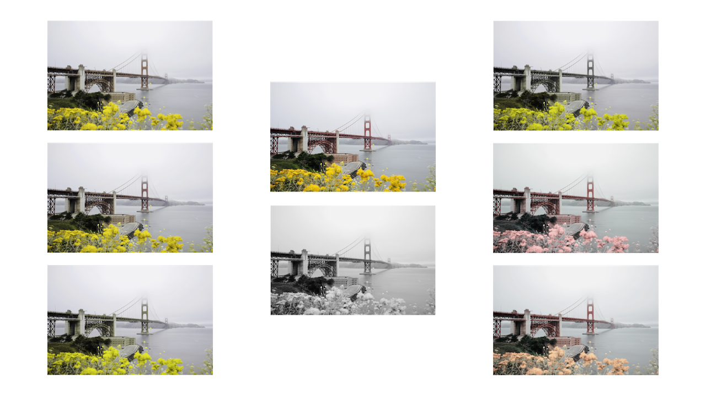

# colorblind-media



A simple client-side JavaScript solution aimed at enhancing the accessibility of media content on the web for individuals with [color blindness](https://www.colourblindawareness.org/colour-blindness/). It focuses on providing support for users with various [types](https://www.colourblindawareness.org/colour-blindness/types-of-colour-blindness/) of color vision deficiencies, allowing them to experience media elements, such as images and videos, in a way that accommodates their visual needs. This project is ideal for web developers seeking to make their websites more inclusive and accessible, as well as for educational purposes to illustrate the importance of accessibility in digital media.

```js
const filters = [
  {
    id: "deuteranopia",
    values:
      "0.29031,0.70969,0.00000,0,0 0.29031,0.70969,0.00000,0,0 -0.02197,0.02197,1.00000,0,0 0,0,0,1,0",
  },
  {
    id: "deuteranomaly",
    values:
      "0.57418,0.42582,0.00000,0,0 0.17418,0.82582,0.00000,0,0 -0.01318,0.01318,1.00000,0,0 0,0,0,1,0",
  },
  {
    id: "protanopia",
    values:
      "0.10889,0.89111,0.00000,0,0 0.10889,0.89111,0.00000,0,0 0.00447,-0.00447,1.00000,0,0 0,0,0,1,0",
  },
  {
    id: "protanomaly",
    values:
      "0.46533,0.53467,0.00000,0,0 0.06533,0.93467,0.00000,0,0 0.00268,-0.00268,1.00000,0,0 0,0,0,1,0",
  },
  {
    id: "tritanopia",
    values:
      "1.00000,0.15236,-0.15236,0,0 0.00000,0.86717,0.13283,0,0 0.00000,0.86717,0.13283,0,0 0,0,0,1,0",
  },
  {
    id: "tritanomaly",
    values:
      "1.00000,0.09142,-0.09142,0,0 0.00000,0.92030,0.07970,0,0 0.00000,0.52030,0.47970,0,0 0,0,0,1,0",
  },
  {
    id: "achromatopsia",
    values:
      "0.299,0.587,0.114,0,0 0.299,0.587,0.114,0,0 0.299,0.587,0.114,0,0 0,0,0,1,0",
  },
];
```
